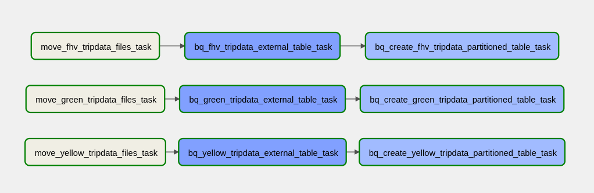

# Week 3
This week we keep learning about Apache airflow and how to integrate with BigQuery to create data pipelines.  
On the week lectures we create a Data pipeline that retreives all the parquet file associated with **yellow**, **green** or **fhv** to create a external table for each dataset and then create another table but now partitioned. Since each dataset is independent from another the DAG proposed is as follow:

The DAG was divided into 3 main tasks:
1. Move files from raw folder to a better file structure on GCS using the GCS operator.
2. Create external table from all the *.parquet* files in each dataset.
3. Create a partitioned table by the *pickup_datetime* field.  
**The last 2 tasks where defined using the BigQueryOperator on airflow**.

Please see attached my Query solution for the answers given for homework.
~~~~sql
-- Question #1
SELECT 
    count(*)
FROM 
    `daring-codex-339319.trips_data_all.fhv_tripdata`
WHERE 
    DATE(pickup_datetime) BETWEEN "2019-01-01" AND "2019-12-31";

-- Question #2
SELECT 
    COUNT(DISTINCT dispatching_base_num) 
FROM 
    `daring-codex-339319.trips_data_all.fhv_tripdata`;

-- Question #4
CREATE OR REPLACE TABLE 
    `daring-codex-339319.trips_data_all.fhv_tripdata_q4clustering`
PARTITION BY 
    DATE(pickup_datetime)
CLUSTER BY 
    dispatching_base_num 
AS
SELECT * FROM `daring-codex-339319.trips_data_all.fhv_tripdata`; 

SELECT
    COUNT(*)
FROM 
    `daring-codex-339319.trips_data_all.fhv_tripdata_q4clustering`
WHERE 
    DATE(pickup_datetime) BETWEEN '2019-01-01' AND '2019-03-31'
    AND 
    dispatching_base_num IN ('B00987', 'B02060', 'B02279');

-- Question #5
SELECT 
    COUNT(DISTINCT(SR_Flag))
FROM 
    `daring-codex-339319.trips_data_all.fhv_tripdata`
WHERE 
    DATE(pickup_datetime) BETWEEN "2019-01-01" AND "2019-03-31";
-- Since SR_Flag distinct types are less than dispatching_base_num the best practice is to partition by SR_Flag and cluster by dispatching_base_num
~~~~